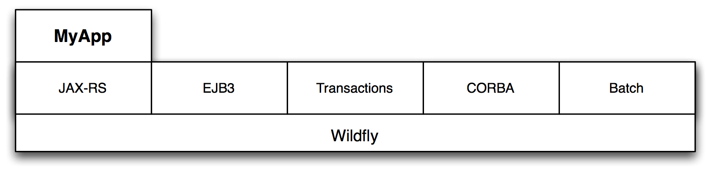
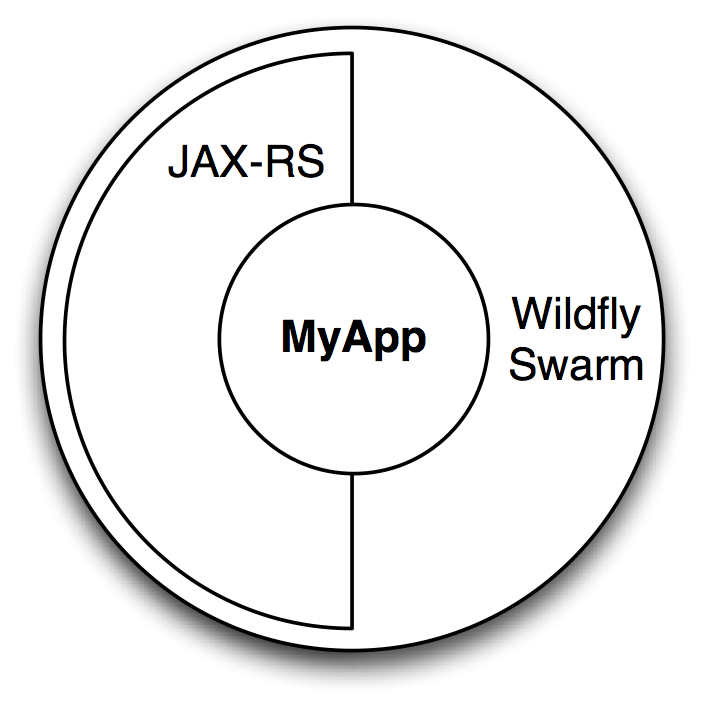

= Basics of WildFly Swarm

WildFly Swarm is a project that has taken the WildFly Java Application Server and deconstructed it into fine-grained parts. WildFly Swarm then allows the selective reconstitution of those parts back together with your application to allow building self-contained executable "uberjars".

The point of these machinations is to support microservices while providing just-enough-appserver to support whatever subset of traditional JavaEE APIs your application requires.

Additionally, WildFly Swarm brings other state-of-the-art components to your application, integrating them seamlessly.  This includes authentication/authorization from Keycloak, client-side load-balancing via NetflixOSS Ribbon/Hystrix, and log aggregation using Logstash.

== Monolithic Application Server

== Uberjar WildFly Swarm

