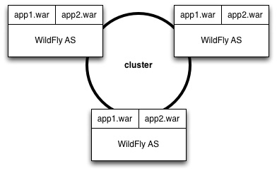
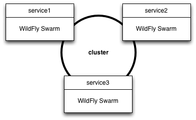

= Clustering

Traditional WildFly includes a subsystem for _clustering_, so that many instances can work together to distribute load. Typically, in a WildFly cluster, each node is homogeneous, serving the same applications.

WildFly Swarm uses the same subsystem but to a different end. With a cluster of WildFly Swarm services, each service may be unique and distinct.  Clustering, in tandem with the <<netflixoss#,NetflixOSS>> stack, serves to assist in discovery of other services.

== Configuration

To enable clustering, the following dependency is required:

[source,xml]
----
<dependency>
  <groupId>org.wildfly.swarm</groupId>
  <artifactId>wildfly-swarm-clustering</artifactId>
</dependency>
----

== JGroups

The WildFly clustering functionality is built upon JGroups, a reliable group communications stack. By default, it uses _IP multicast_ to locate other members of the cluster. In environments where multicast is not supported, other components may be used.